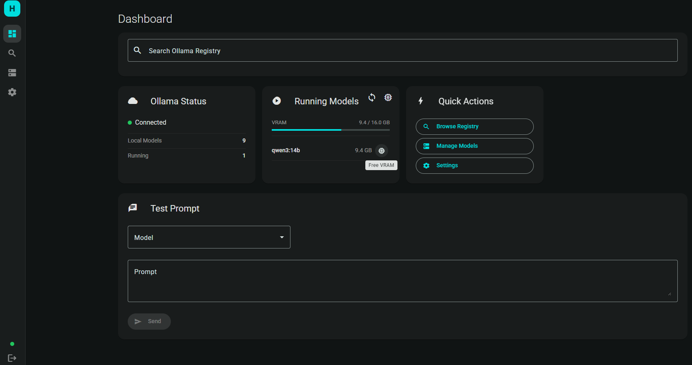
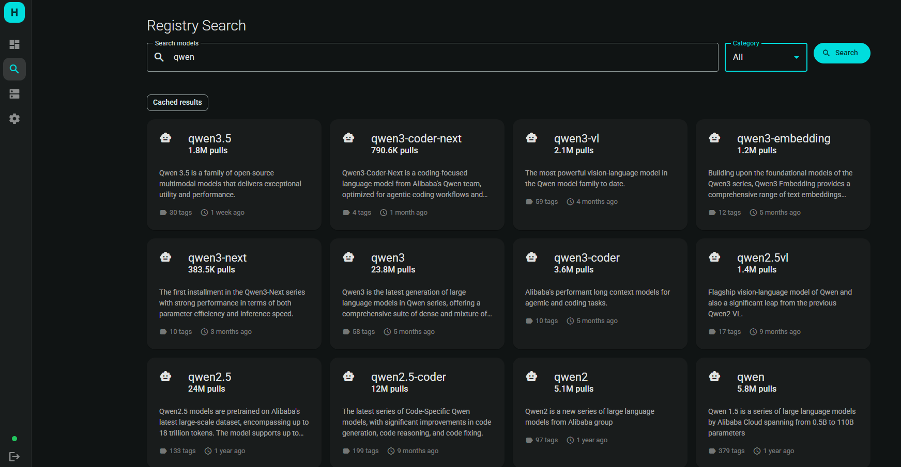
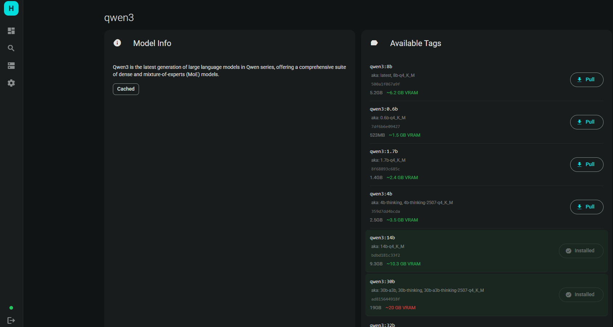
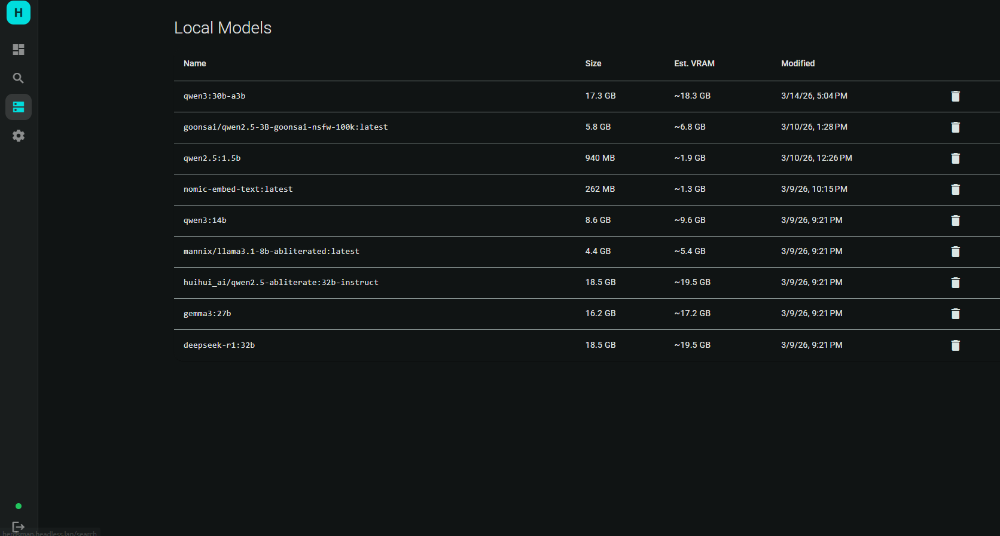

# Herdsman

Self-hosted web app for managing [Ollama](https://ollama.com) models. Ollama doesn't provide a search API — Herdsman fills that gap with a registry browser (ollama.com scraping), local model management, and VRAM estimation.

## Features

- **Registry Browser** — Search and explore the Ollama model library directly from the UI
- **Local Model Management** — List, inspect, pull, and delete models on your Ollama instance
- **Pull Queue** — Sequential download queue with real-time progress via SSE
- **VRAM Estimation** — Estimate memory requirements based on parameter count and quantization
- **Running Models** — Monitor currently loaded models and their VRAM usage
- **VRAM Management** — Free individual models or all at once from GPU memory without deleting them
- **Test Prompt** — Send prompts to any local model directly from the dashboard
- **Settings UI** — Configure Ollama host, VRAM budget, cache TTLs, and change admin password
- **SQLite Cache** — Cached registry data with configurable TTLs (search: 24h, details: 7d)
- **Single-User Auth** — JWT-based authentication with 24h token expiry
- **Dark Theme** — Clean, modern UI inspired by Perplexica / Immich

## Screenshots

### Dashboard


### Registry Search


### Model Tags


### Local Models


## Quick Start

### Docker Run

```bash
docker run -d \
  --name herdsman \
  -p 4200:80 \
  -e HERDSMAN_OLLAMA_HOST=http://host.docker.internal:11434 \
  -e HERDSMAN_ADMIN_PASSWORD=change-me \
  -e HERDSMAN_SECRET_KEY=your-secret-key \
  -v herdsman-data:/app/data \
  --restart unless-stopped \
  skydiverookie/herdsman:latest
```

### Docker Compose

Create a `docker-compose.yml`:

```yaml
services:
  herdsman:
    image: skydiverookie/herdsman:latest
    ports:
      - "4200:80"
    environment:
      - HERDSMAN_OLLAMA_HOST=http://host.docker.internal:11434
      - HERDSMAN_ADMIN_PASSWORD=change-me
      - HERDSMAN_SECRET_KEY=your-secret-key
    volumes:
      - herdsman-data:/app/data
    restart: unless-stopped

volumes:
  herdsman-data:
```

```bash
docker compose up -d
```

### Build from Source

```bash
git clone https://github.com/skydiverookie/herdsman.git
cd herdsman
docker build -t herdsman .
docker run -d --name herdsman -p 4200:80 -v herdsman-data:/app/data herdsman
```

The app is available at **http://localhost:4200**.

Default credentials: `admin` / `admin`

### Connecting to Ollama

Set `HERDSMAN_OLLAMA_HOST` to point to your Ollama instance:

| Setup | Value |
|-------|-------|
| Ollama on same machine (Docker Desktop) | `http://host.docker.internal:11434` |
| Ollama on same machine (Linux) | `http://172.17.0.1:11434` |
| Ollama on another host | `http://<ip>:11434` |
| Ollama in same Docker network | `http://ollama:11434` |

## Configuration

All settings use the `HERDSMAN_` prefix and can be set via environment variables.

| Variable | Description | Default |
|----------|-------------|---------|
| `HERDSMAN_OLLAMA_HOST` | Ollama API base URL | `http://host.docker.internal:11434` |
| `HERDSMAN_ADMIN_USER` | Admin username | `admin` |
| `HERDSMAN_ADMIN_PASSWORD` | Initial admin password | `admin` |
| `HERDSMAN_SECRET_KEY` | JWT signing secret | `change-me-in-production` |
| `HERDSMAN_JWT_EXPIRY_HOURS` | Token lifetime in hours | `24` |
| `HERDSMAN_CACHE_TTL_SEARCH` | Search cache TTL in seconds | `86400` (24h) |
| `HERDSMAN_CACHE_TTL_DETAILS` | Model details cache TTL in seconds | `604800` (7d) |
| `HERDSMAN_TOTAL_VRAM_GB` | Total GPU VRAM for estimation | `0.0` (disabled) |
| `HERDSMAN_DB_PATH` | SQLite database file path | `data/herdsman.db` |

## Tech Stack

| Component | Technology |
|-----------|------------|
| Backend | Python 3.12, FastAPI, async |
| Frontend | Angular 21, Standalone Components, Angular Material |
| Database | SQLite via aiosqlite |
| Scraping | BeautifulSoup + httpx |
| Auth | JWT (python-jose + bcrypt) |
| Realtime | Server-Sent Events (SSE) |
| Container | Single image: nginx + uvicorn + supervisord |

## VRAM Estimation

Herdsman estimates GPU memory requirements using the formula:

```
VRAM (GB) = Parameters (B) x Bytes per Parameter + Overhead (1 GB)
```

| Quantization | Bytes/Param | Example: 7B Model |
|-------------|-------------|-------------------|
| FP16 | 2.000 | 15.0 GB |
| Q8_0 | 1.000 | 8.0 GB |
| Q6_K | 0.750 | 6.3 GB |
| Q5_K_M | 0.625 | 5.4 GB |
| Q4_K_M | 0.500 | 4.5 GB |
| Q4_0 | 0.500 | 4.5 GB |
| Q3_K_M | 0.375 | 3.6 GB |
| Q2_K | 0.250 | 2.8 GB |

Set your total VRAM in Settings to see fit indicators when browsing models.

## API

All endpoints (except `/api/auth/login` and `/health`) require a JWT token via `Authorization: Bearer <token>`.

| Method | Endpoint | Description |
|--------|----------|-------------|
| `POST` | `/api/auth/login` | Authenticate and get JWT |
| `GET` | `/api/ollama/status` | Ollama connection status |
| `GET` | `/api/models` | List local models |
| `GET` | `/api/models/running` | List loaded models |
| `GET` | `/api/models/{name}/details` | Model details |
| `POST` | `/api/models/pull` | Pull model (SSE stream) |
| `POST` | `/api/models/unload` | Unload model from VRAM |
| `POST` | `/api/models/generate` | Send prompt to model |
| `GET` | `/api/models/queue` | Pull queue status |
| `DELETE` | `/api/models/{name}` | Delete model |
| `GET` | `/api/registry/search` | Search ollama.com registry |
| `GET` | `/api/registry/models/{name}/details` | Registry model details |
| `GET` | `/api/registry/models/{name}/tags` | Available tags |
| `GET` | `/api/settings` | Get settings |
| `PUT` | `/api/settings` | Update settings |
| `PUT` | `/api/settings/password` | Change password |

Swagger UI available at `/docs` when running locally.

## Local Development

```bash
# Backend
cd backend
pip install -r requirements.txt
uvicorn app.main:app --reload --port 8000

# Frontend
cd frontend
npm install
ng serve
```

## License

MIT
